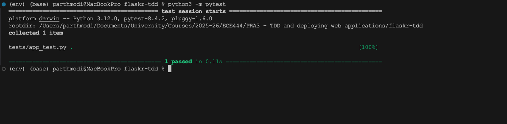
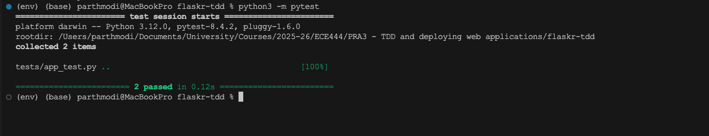
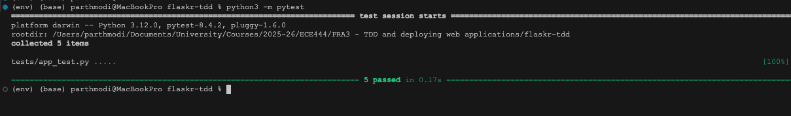
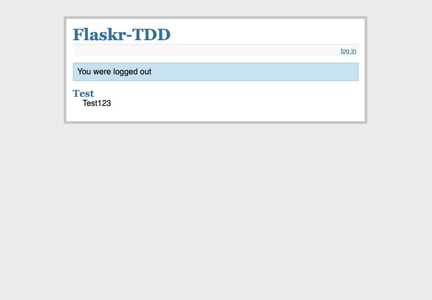
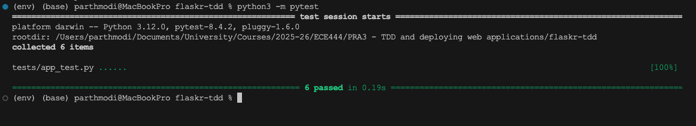
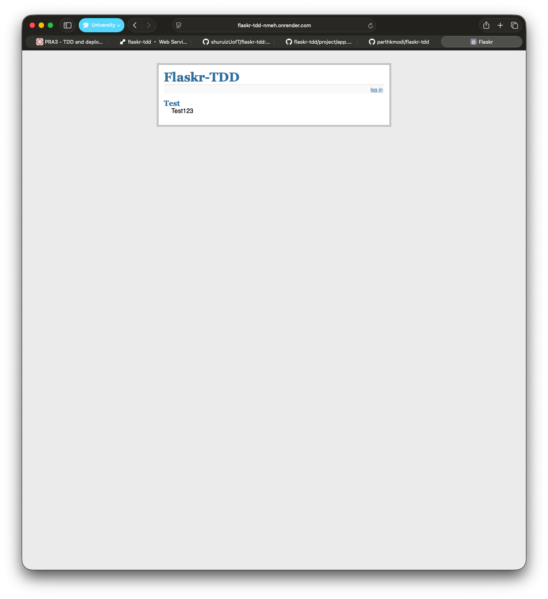

# E444-F2025-PRA3

####
Name: Parth Modi

This repo is adapted from [shuruizUofT/flaskr-tdd](https://github.com/shuruizUofT/flaskr-tdd)

### 1. Initial Tests Passing

### 2. Database Setup and Tests

### 3. Login and Logout functionality with tests

### 4. Styling and Delete message functionality

### 5. Deployment
